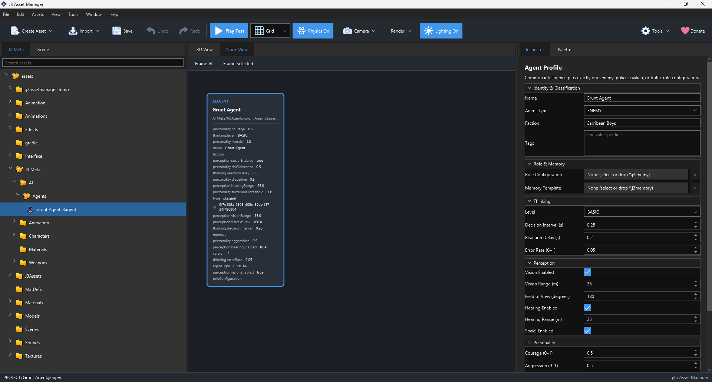

# Agent Profile (`.j3agent`)

An Agent Profile describes decision characteristics for an AI-controlled character: what kind of agent it is, what it can perceive, how often it reevaluates choices, and traits such as courage or aggression. The [AI behaviour system](behaviours.md) explains the broader goal → state → action design.

## Create and edit

Choose **Assets → Create → AI → Agent Profile** and open the new file. The initial asset contains identity, faction and tag fields, memory and role configuration references, Thinking, Perception, and Personality values. Set values that match the intended character and save. Assign the profile in a Character's Agent Profile reference.

*Screenshot placeholder: show an Agent Profile with Thinking, Perception, and Personality groups visible. The image should explain which values tune decisions and sensing.*

## Important fields

| Group | Meaning |
| --- | --- |
| `agentType`, `faction`, `tags[]` | Classify the agent and provide labels other systems can use for eligibility. |
| `memory` | Reference to a memory configuration asset. |
| `roleConfiguration` | Reference to a role-specific configuration such as an enemy or civilian profile. |
| `thinking.level` | Intended decision capability, for example Basic. |
| `thinking.decisionInterval` | Time between ordinary decision reviews. A longer interval reduces decision frequency without stopping movement each frame. |
| `thinking.reactionDelay`, `errorRate` | Authored delay and controlled imperfection in decision behavior. |
| `perception.visionEnabled`, `visionRange`, `fieldOfView` | Whether and how far the agent can see and over what angle. |
| `perception.hearingEnabled`, `hearingRange`, `socialEnabled` | Other sources of awareness. |
| `personality.courage`, `aggression`, `discipline`, `riskTolerance`, `morale`, `surrenderThreshold` | Values from `0–1` that can shape decisions. |

The core model also contains `behaviours[]`, `initialBehaviour`, and parameter data. The current Create Asset menu does **not** offer separate `.j3behaviour`, `.j3state`, or `.j3action` creation entries, so the complete authored hierarchy in the GDD remains a design direction. The Agent Profile itself is a current file type; do not assume every planned behavior is runnable.
