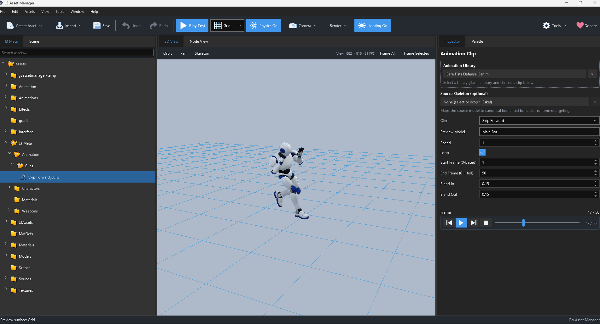

# Animation Clip (`.j3clip`)

An Animation Clip asset points to an animation in a source asset and records how to preview and play a selected range. The `.j3clip` file is saved using jMonkeyEngine's Savable format. It is referenced by locomotion, attacks, reactions, and other systems that need a reusable clip.

## Create and edit

Prepare or import animation source data first. Choose **Assets → Create → Animation → Animation Clip**, then open the file. Select a Source `.j3anim` or `j3o` file, choose one of its clips, and optionally select a source skeleton mapping. Set the range, speed, loop, and blending. Use the media controls to play and step through the clip before relying on it in a move.

*Animation Clip Inspector*

## Fields

| Field | Meaning |
| --- | --- |
| `source` | Project reference to the `.j3anim` animation source. |
| `sourceSkeleton` | Optional `.j3skel` map for the source skeleton. |
| `clip` | Named animation inside the source. Pick after selecting the source. |
| `previewModel` | Male or female preview dummy in the current inspector. It affects the preview choice, not the game's character type. |
| `speed` | Playback multiplier. `1` is normal speed; changing it changes timing. A zero speed cannot play in the melee preview. |
| `loop` | Whether playback repeats by default. A one-off punch usually does not loop; an idle usually does. |
| `startTime`, `endTime` | Chosen subrange. The Melee Attack can also override the source frames for a specific move. |
| `blendIn`, `blendOut` | Default transition times when entering or leaving the clip. |

If the selected animation has a source length and the End field is still zero, the inspector can set the end to that length. The source file, skeleton, and target model must be compatible for a convincing result.

## Use it elsewhere

Choose the `.j3clip` file in a [Melee Attack](melee-attack.md), [Reaction Data](reaction.md), or [Locomotion State](locomotion-state.md). Keep different gameplay uses in separate clip assets when they need different ranges, loop settings, or speeds.
