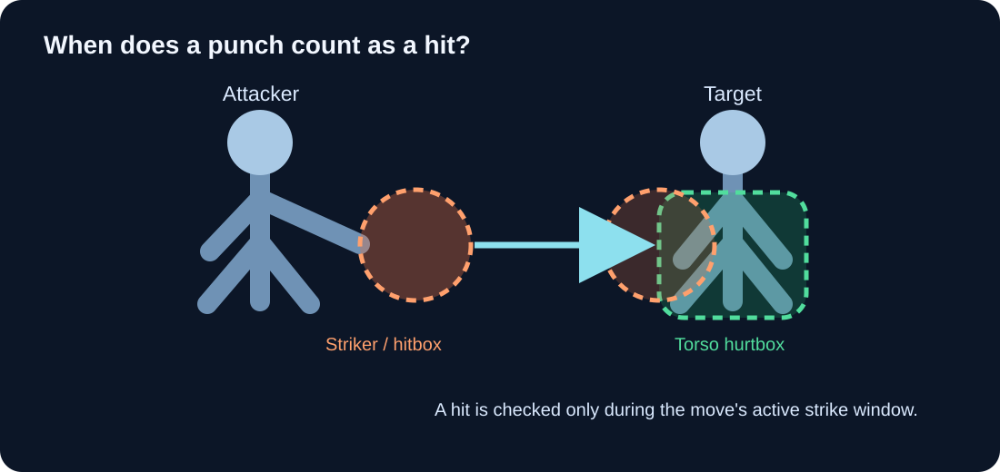

# Hit detection: strikers and hurtboxes

This page explains how a game decides that a punch, kick, or weapon swing hit a character. No physics or game-development background is needed.

## The basic idea

The visible character is made from detailed geometry: a mesh, clothing, hair, and equipment. Checking every tiny triangle of that visible model against every other triangle would be unnecessarily complex for ordinary combat. Instead, the game uses simpler invisible shapes as stand-ins.

An **attack shape** moves with the dangerous part of an attack. A **receiving shape** covers a region that can be struck. When the shapes overlap at the right time, the game registers contact.

```text
Attacker's moving striker (attack shape)
                  overlaps
Target's hurtbox (receiving shape)
                  during
        the attack's active window
                  ↓
              a hit is resolved
```

The overlap alone is not enough. The move must be in its active phase, the target must be valid, and the collision must pass rules such as team filtering.



*Concept diagram: the attacker's hand striker enters the target's torso hurtbox during the active window. The shapes are simplified teaching aids, not a screenshot of the editor.*

## Hitbox, striker, and hurtbox

**Hitbox** is the common term for an offensive collision shape. It answers: “Where can this attack hit?”

**Striker** is the name used by J3 Asset Manager for an authored offensive shape. A striker is the asset-side definition used to create or position a hitbox for a move. For example, a punch may use a small capsule attached to the right hand; a sword attack may use a longer capsule along the blade.

**Hurtbox** is the receiving collision shape on a character. It answers: “Where can this character be hit?” A character can have several hurtboxes for different regions, such as head, torso, hands, or legs.

The terms are paired by role:

| Shape | Role | Typical attachment |
| --- | --- | --- |
| Hitbox / striker | Delivers a hit | Hand, foot, weapon, projectile, or explosion center |
| Hurtbox | Receives a hit | Character body region |

These shapes are usually invisible during gameplay. Debug views may draw them as boxes, spheres, or capsules so a developer can see and adjust them.

## Why there are several body hurtboxes

A single large receiving shape around the whole character is simple, but it cannot distinguish where the attack landed. Separate shapes let the game identify a likely body location. That can support different damage multipliers, hit reactions, armor rules, or feedback for a head, torso, hand, or leg hit.

The shapes are approximations. A torso capsule does not reproduce the exact outline of clothing or muscle; it gives the combat system a stable and efficient region to test. The author balances accuracy, readability, and ease of tuning.

## A worked example: right-hand punch

1. The character begins a punch animation. During wind-up, no punch striker is active, so the fist passing near a target does not yet cause damage.
2. The attack reaches its active strike window. The move enables its configured right-hand striker.
3. The striker follows the right hand as the animation moves it forward.
4. If the striker overlaps a valid opponent hurtbox, the runtime records contact. If it misses, no hit is recorded.
5. The hit is resolved using the attack's damage and the target's damage settings. The contacted hurtbox can identify the approximate body location for the reaction.
6. The active window ends. The attack enters recovery, and the striker no longer causes hits.

Normally, one target should be counted at most once during a single swing. An authored move may allow repeated hits, but this should be deliberate, as with a sustained spinning attack or damaging field.

## How J3 assets describe the shapes

### `.j3striker`

A striker asset describes one offensive shape, including its basic geometry and how it is placed relative to a bone or weapon section. A shape can be attached to a canonical bone role so projects with different joint names can use skeleton mapping.

Typical shape choices are:

- **Box:** useful for a broad flat region, such as a striking surface.
- **Sphere:** useful for a rounded contact point.
- **Capsule:** useful for an elongated region, such as a forearm, bat, or blade segment.

The striker's offset and rotation position the shape relative to its attachment. The attack chooses which strikers are relevant for that move; a punch should not activate every striker on the character.

### `.j3hurtbox`

A hurtbox profile describes one or more receiving shapes for a character. The current `.j3hurtbox` editor uses bone-attached boxes. Each box can be associated with a body location. Damage settings can scale the damage the character receives, and the location can help select a suitable reaction.

### `.j3melee` and `.j3damage`

An attack asset supplies the timing and move data, including when its strike is active and which striker references to use. A damage configuration connects a character to its receiving hurtbox profile and reaction data.

```text
.j3melee → active timing + selected .j3striker shapes
                                      ↓ overlap check
Character → .j3damage → .j3hurtbox shapes → body location / damage response
```


*Screenshot placeholder: show two posed characters or one attacker and one target. Use one color for the active striker and another for the target's hurtboxes; label “attack shape” and “receiving shape.” The image should show a clear overlap at the moment a punch connects.*

## Common setup problems

| What you see | Possible cause |
| --- | --- |
| The animation looks like a hit, but the target takes no damage. | The strike window may be mistimed, the striker may not overlap, a bone reference may be wrong, or the target may be filtered out. |
| The target takes damage before the limb reaches it. | The striker may be too large, offset from the limb, or active too early. |
| One attack damages the same target repeatedly. | The move may permit repeated hits, or the runtime may not be tracking hits per swing as intended. |
| The hit appears to come from the wrong body part. | A striker may be attached to the wrong bone, or the shape's local offset/rotation may be incorrect. |
| All attacks seem to hit the whole body. | A receiving shape may be oversized, or multiple shapes may overlap excessively. |

Use debug previews to inspect the shapes while the character is posed through the relevant animation. Then test the result in runtime; the runtime transform and filtering rules determine the final outcome.

## Current implementation status

J3 Asset Manager contains structured asset models and inspectors for attack, striker, hurtbox, damage, and reaction data. The GDD describes intended combat behavior and future asset relationships. Availability of a complete runtime hit-detection pipeline depends on the version of the J3 runtime being used; editor support for a data type should not be mistaken for a guarantee that every combat rule is already implemented.

## Design source

This concept follows the project's *Ultimate Bounty Hunter* GDD, Revision 2, especially *Combat Style* and *J3 Asset Manager Software*. The terms explain the intended design in plain language; runtime behavior should be verified against the current J3 runtime.
