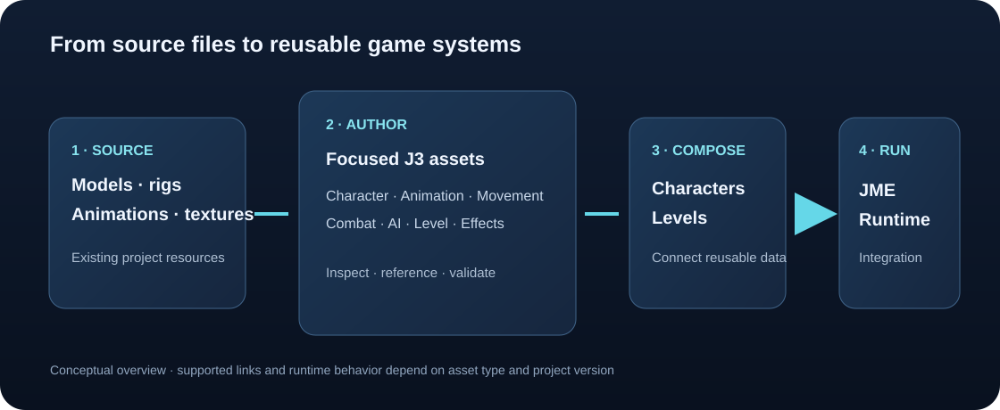

# J3 asset concepts

J3 assets are structured project files that describe reusable game data. They aim to keep configuration visible, referenceable, and editable through purpose-built inspectors. The exact schema and runtime support can change while the project is in development.

*Concept map: source resources feed focused J3 configuration assets, which can be connected to characters and game systems and consumed by runtime integrations.*

## Asset families

| Family | Examples | Role |
| --- | --- | --- |
| Character and model | `.j3char`, `.j3model`, `.j3skel` | Describe a character, its model metadata, and skeleton mapping. |
| Animation | `.j3clip`, `.j3loco` | Define animation ranges and locomotion setup. |
| Input and movement | `.j3input`, `.j3move` | Describe input schemes and movement configuration. |
| Combat | `.j3combat`, `.j3damage`, `.j3weapon`, `.j3attackset`, `.j3melee`, `.j3striker`, `.j3hurtbox`, `.j3reaction`, `.j3firearm`, `.j3charge`, `.j3attackfx` | Compose combat behavior from reusable assets. |
| AI and world | `.j3enemy`, `.j3social`, `.j3memory`, `.j3inventory`, `.j3level`, `.j3wave` | Configure agent roles, inventories, levels, and encounter waves. |
| Effects | `.j3effect` | Configure reusable effect data and previews where supported. |

These names describe formats found in the project; they do not promise every type is stable or fully supported. Check the editor and source for current behavior.

## Relationships

*Concept: a character asset acts as a hub that can reference model, movement, animation, combat, and damage configuration. Exact links depend on the asset schema and are subject to change.*

## Guides

- [Characters and models](characters.md)
- [Animation and locomotion](animation.md)
- [Movement and input](movement-input.md)
- [Combat and weapons](combat.md)
- [Hit detection: strikers and hurtboxes](hit-detection.md)
- [AI behaviour system](behaviours.md)
- [AI, levels, and effects](world-ai-effects.md)

For creation steps and individual inspector fields, use the [asset field guides](../index.md#asset-field-guides) or browse the [complete Create Asset catalogue](../reference/asset-catalogue.md).

## Common authoring principles

- Prefer reusable assets over duplicating the same configuration across characters.
- Use clear names and keep related resources in predictable folders.
- Check referenced asset paths and validation feedback after editing.
- Keep source models, textures, and animation files available to the project.
- Treat schemas as versioned project data; back up work before changing formats.
