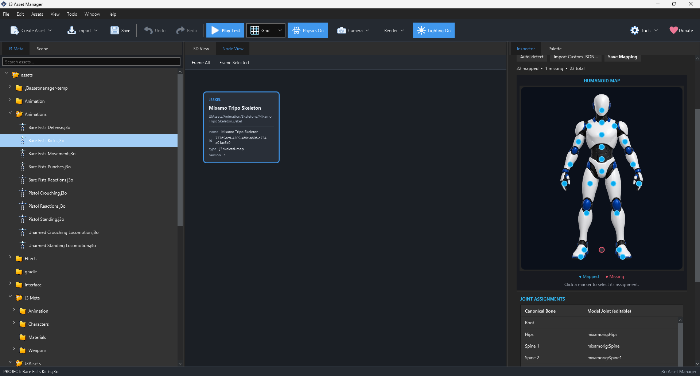

# Skeletal Mapping (`.j3skel`)

Models often use different names for equivalent joints. One model might call a joint `RightHand`; another may use an imported rig name. Skeletal Mapping links a standard humanoid role to the concrete joint in a rigged `.j3o` or `.j3model` file. Animation, strikers, hurtboxes, and attachments can then refer to a stable role.

## Create and edit

Choose **Assets → Create → Animation → Skeletal Mapping**. Open the file and choose a rigged `.j3o` or `.j3model` file. The inspector reads its joints, offers preset or automatic matching, and shows a role-to-joint table and humanoid view. Review every important assignment before saving. Automatic matching is a starting point; incorrect hand or foot mappings make combat shapes and animations appear in the wrong place.

*Screenshot placeholder: show the selected model, the humanoid role diagram, and the role-to-joint table with a hand mapping highlighted. The image should explain how an imported bone name becomes a canonical role.*

## Fields

| Field | Meaning |
| --- | --- |
| `name` | Authoring label for the mapping. |
| `modelAsset` | Rigged `.j3o` or `.j3model` file whose skeleton is being mapped. |
| `bones` | Table from humanoid roles to the model's actual joint names. |

Choose the model first so the joint list is populated. Then compare the mapped joint with the visible part of the rig. A right-hand striker needs the actual right-hand joint or an appropriate mapped role; selecting the wrist of the wrong arm can make contact impossible or unfair.
