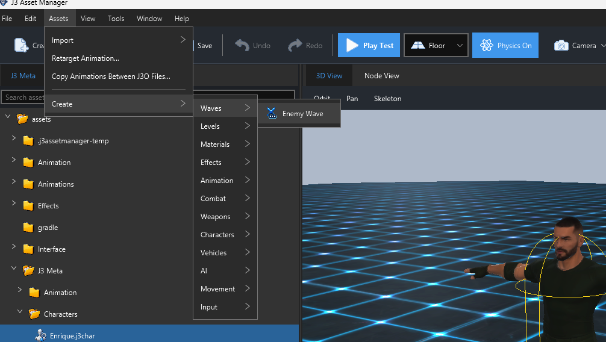
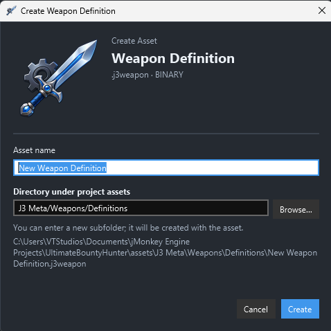
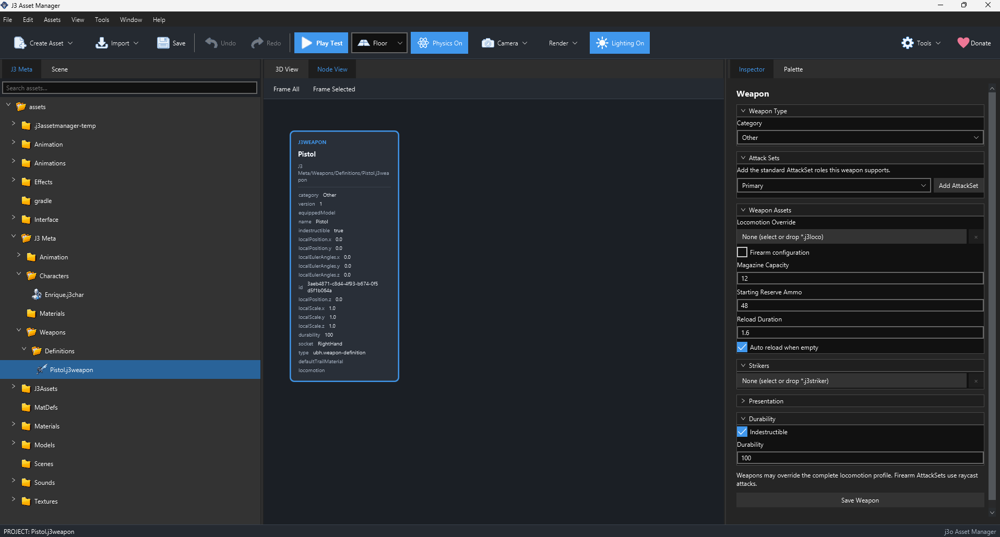

# Create and edit an asset

Open a jMonkeyEngine project in J3 Asset Manager first.

- Go to **File -> Open Project**
- Select a valid jME project, or its assets folder.
- The Assets folders will now appear on the left Assets Panel.

To create a J3 asset, from the top menu, go to **Assets → Create** menu and the toolbar **Create Asset** button are populated from the current asset catalogue. Categories group types such as Combat, Weapons, Animation, Movement, AI, and Levels.

*Assets → Create menu*

## Create a file

1. Choose **Assets → Create**, select a category, then choose the asset type named in its field guide. The toolbar **Create Asset** menu offers the same categories.
2. In the **Create Asset** window, enter a descriptive name. The dialog shows the extension and output path.
3. Keep the suggested directory or choose another directory **inside the project assets folder**. The path shown in the dialog is relative to that folder.
4. Select **Create**. The editor creates the file and opens or selects it in the project browser.

The name cannot be empty, contain reserved filename characters (`\\ / : * ? " < > |`), or end in a dot or space. If a file with the same name already exists in the chosen directory, creation reports an error instead of overwriting it.

*Weapon Asset Creation Dialog.*

## Edit and save

Select the new file in the project browser. Supported types open their dedicated inspector. Set values and choose referenced assets using the picker fields; some inspectors also accept a project file dragged into a list. Use the inspector's **Save** button when it provides one. Some fields save automatically, but explicit Save is the safe final step before closing the asset.

Read validation text next to or below the inspector after saving. If the save fails, correct the named field and save again. A new asset often starts as a draft with empty references. Fill those references before expecting the asset to work in the runtime.

*J3 Wepaon Inspector*

## Where files are saved

The Create Asset dialog suggests the type's registered folder under the project's asset root. The default authored directory is `J3 Meta`: for example, the current catalogue places **Melee Attack** in `J3 Meta/Combat/Melee`, **Attack Set** in `J3 Meta/Combat/AttackSets`, and **Weapon Definition** in `J3 Meta/Weapons/Definitions`. A project can configure another authored directory. You can also choose a different directory inside the project assets folder. References should continue to use the project-relative asset key.

## What creation does not complete

Creating a file does not automatically connect it to a character, weapon, level, or runtime controller. Follow the asset's **Connect it** section and the [first melee character walkthrough](first-melee-character.md) to build those relationships.
