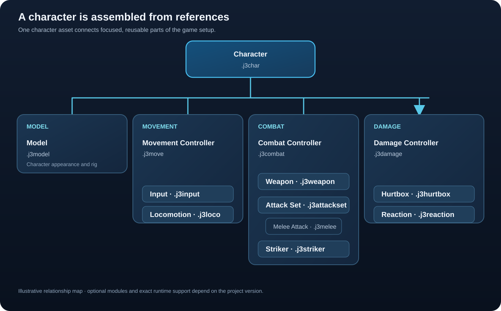

# What is a J3 asset?

A J3 asset is a saved description of one part of a game. A character file describes the character and points to other files for its model, movement, combat, and damage rules. An attack file describes one move; a weapon file collects attacks and striking shapes. This lets one asset be reused by several characters without copying its settings into every character.

## Resource and configuration

A model (`.j3o`) holds scene geometry and may contain a skeleton and animations. A material (`.j3m`) describes how a surface looks. A J3 configuration asset such as `.j3weapon` or `.j3melee` describes how game systems should use those resources.

For example, the visible bat model is the prop. The weapon definition says where to attach it, which attacks it offers, and which striker shapes represent its damaging region. A separate melee attack says when one swing becomes active and how much damage it deals.

## A character is assembled from references

The diagram shows a common authoring path. Optional modules and exact runtime support depend on the project version.

## Why use several small assets?

One attack can be reused by more than one attack set. A shared hurtbox profile can give similar characters the same receiving shape layout. A weapon can change its attacks or presentation without changing the character file. Each piece has a clear responsibility and can be inspected on its own.

This also means references matter. If you move or remove a file, an asset that points to it may need updating. Read [asset references](references.md) before reorganizing a project's folders.

## Identity, filename, and display name

Many structured assets contain an internal `id`, `type`, `version`, and `name`. The file path is the project asset key used by references. The displayed name helps a person recognize the asset. Treat the generated ID and format version as schema information; edit the named fields in the inspector unless you are intentionally maintaining the file format.

Next: [Create and edit an asset](create-and-edit.md).
